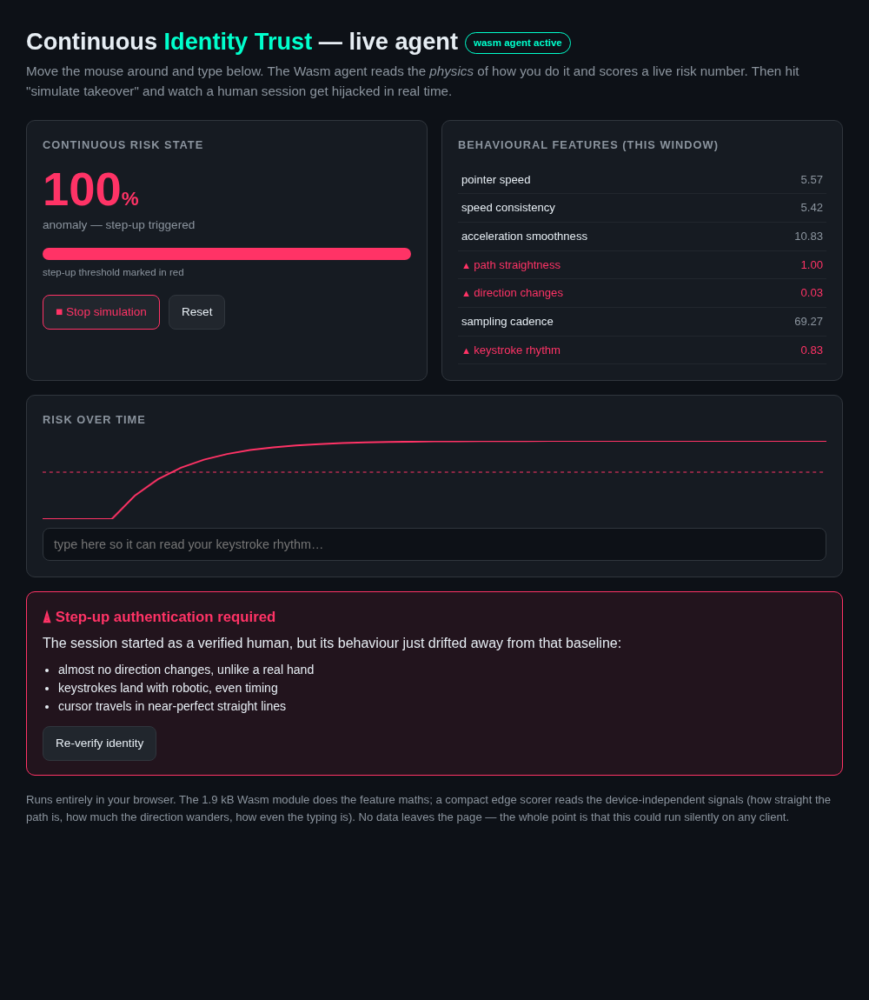

# Continuous Identity Trust

Logging in once and then trusting someone for the whole session is a bad bet. People
get phished, sessions get stolen, and a bot can pick up right where a real user left
off — and point-in-time auth never sees any of it. Your only other lever is nagging
everyone for OTPs constantly, which users hate.

So this does the other thing: it keeps watching *how* someone behaves after they log
in — the way the mouse moves, the rhythm of the typing — and keeps a running "how much
do I trust this session right now" score. If that score spikes, it asks for another
factor. If it doesn't, the user never even knows it was there. Friction only shows up
when something's actually wrong.

This repo is a runnable **prototype** of that idea. No infra needed — the telemetry is
synthetic so you can just run it — but everything past the data generation is real: the
features, the model, the continuous scoring, the step-up trigger, the reason codes, and
a genuine Wasm agent that runs the same feature maths live in a browser.



> 📊 The pitch deck is [`pitch.html`](pitch.html).
> 📓 The full walkthrough (with all the charts) is [`demo.ipynb`](demo.ipynb).
> 🖱️ The interactive thing you can actually play with is [`web/live.html`](web/live.html).

---

## The three ways to look at it

**1. Play with it live (most fun).** Open the browser demo, wiggle the mouse, type a
bit, then hit "simulate takeover" and watch the risk climb and trip step-up in real
time. The 1.9 kB Wasm agent reads your actual pointer/keystroke physics.

```bash
cd web && python -m http.server        # then open http://localhost:8000/live.html
```

**2. Run the whole pipeline headless.**

```bash
uv sync
uv run quickstart.py
```

```
held-out ROC-AUC : 0.9997
Replaying an account-takeover session (human -> bot at 50%)...
  takeover at      :   9.8s
  STEP-UP fired at :  12.6s  (latency 2.8s)
  reasons          :
    - pointer speed (11.0sigma off the human baseline)
    - speed consistency (5.2sigma off the human baseline)
    - acceleration smoothness (4.0sigma off the human baseline)
```

**3. Read the notebook.** `uv run jupyter lab demo.ipynb` — the guided version with
every plot: human-vs-bot motion, the features, training, the takeover catch, reason
codes, the friction analysis, a fleet view, and the edge model.

---

## How it actually works

```
 Telemetry            Features            Inference            Feedback loop
 (Wasm agent)   -->   (Polars)      -->   (risk score) -->     (step-up auth)
 mouse + keys         7 behavioural       continuous, smoothed  fires mid-session
 kinematics           physics features    "risk state"          when risk stays high
```

1. **Telemetry** — pointer position + keystroke timing, sampled fast. It never looks at
   *what* you do, only the physics of *how*. (Synthetic in the prototype; the real thing
   streams from the Wasm agent in `agent/`.)
2. **Features** — Polars chops the stream into short windows and reduces each to seven
   interpretable numbers: path straightness, direction-change variance, speed jitter,
   keystroke-timing variance, and so on. Bots and hands look nothing alike here.
3. **Inference** — a gradient-boosted model scores each window; an exponential moving
   average smooths that into a continuous risk state, so one weird window doesn't fire
   an alarm but a *sustained* shift does.
4. **Feedback loop** — cross the threshold and step-up auth fires automatically, with
   reason codes attached (which behaviours drifted, and by how many sigma). No black box.

The headline scenario is the one static auth can't touch: a session that starts as a
real human, passes login, and gets hijacked halfway through. The engine catches it
about 3 seconds after the behaviour turns malicious.

The notebook also checks the friction claim honestly — real people occasionally drag
the mouse in a straight line, and a naive "challenge on any suspicious window" policy
false-alarms on **100%** of those users. The smoothed continuous state? **2%**. Both
still catch every takeover.

---

## Layout

```
pitch.html          the pitch deck (reveal.js)
demo.ipynb          the full visual walkthrough — main deliverable
quickstart.py       headless end-to-end run
src/cit/
  telemetry.py      synthetic behavioural telemetry (human / bot / takeover)
  features.py       Polars feature engineering over event windows
  engine.py         risk model + streaming SessionMonitor + step-up + reason codes
  edge.py           the tiny logistic "edge" model that ships to the client
agent/
  src/lib.rs        the Wasm telemetry agent (Rust, no_std, ~2 kB)
  build.sh          builds it into web/agent.wasm
web/
  live.html         the interactive in-browser demo
  agent.wasm        prebuilt agent (so you don't need Rust to try it)
  model.json        exported edge model
```

### Rebuilding the Wasm agent (optional)

You don't need to — `web/agent.wasm` is committed. But if you want to:

```bash
rustup target add wasm32-unknown-unknown   # once
./agent/build.sh
```

The Rust agent computes the exact same seven features as `features.py` — I checked them
against each other and they match to the decimal.

---

## Prototype → production

The decision core is real. Shipping it is mostly swapping the data source and scaling
the runtime:

| Piece | This prototype | Production (per the pitch) |
| ----- | -------------- | -------------------------- |
| Telemetry | synthetic generator | the Wasm agent in `agent/`, streaming for real |
| Ingestion | in-process Polars | async Python + websockets + Polars |
| Inference | scikit-learn GBM | PyTorch / XGBoost, Numba-compiled features |
| Session state | a `SessionMonitor` object | Redis, one risk score per live session |
| The action | a `stepped_up` flag | an API call that forces step-up auth |

Trust isn't a gate you pass once. It's a number you keep watching — and you can defend
it in real time without making honest users suffer for it.

---

*Hackathon prototype. Telemetry is synthetic; everything downstream of it is the real engine.*
